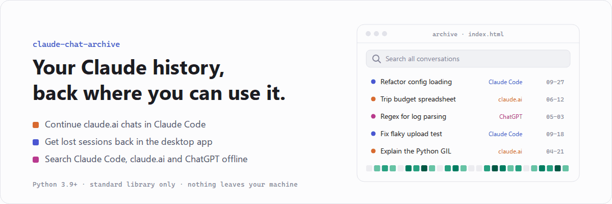
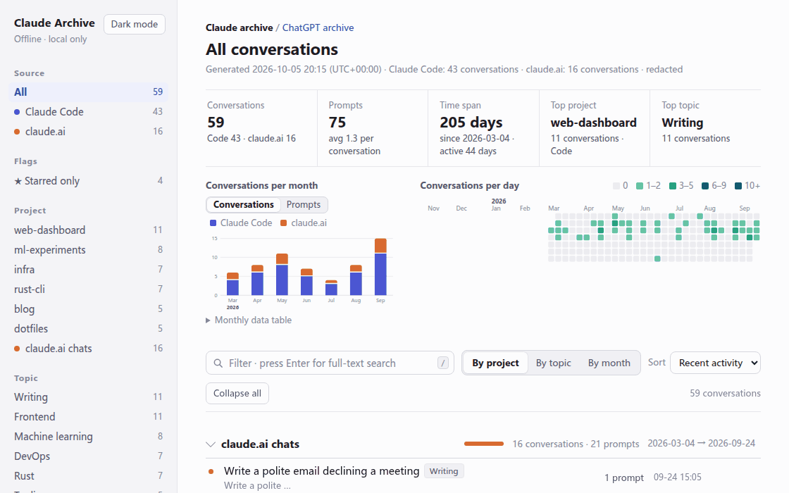
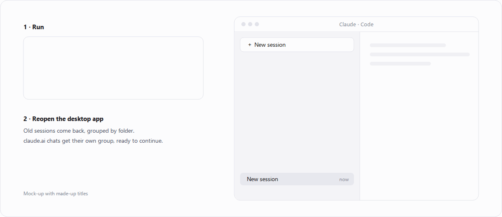
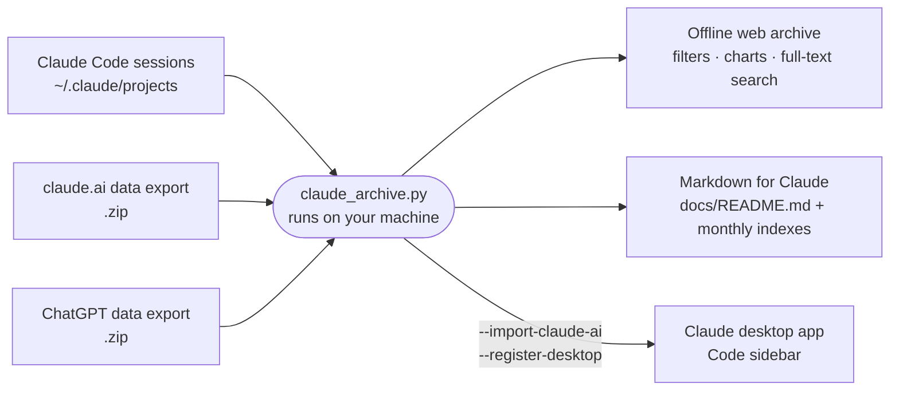
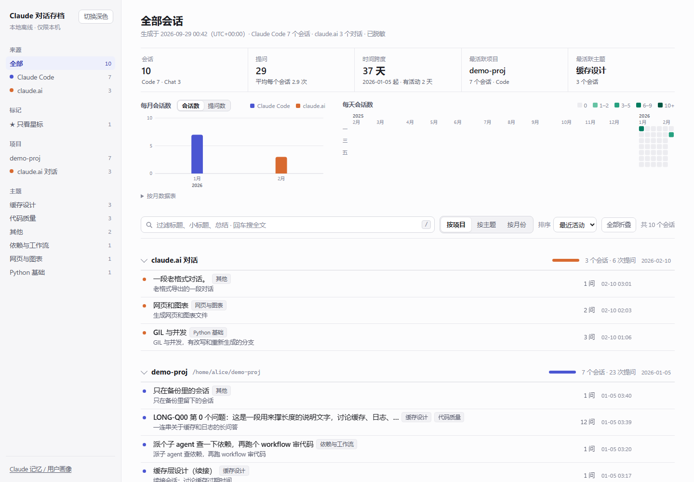
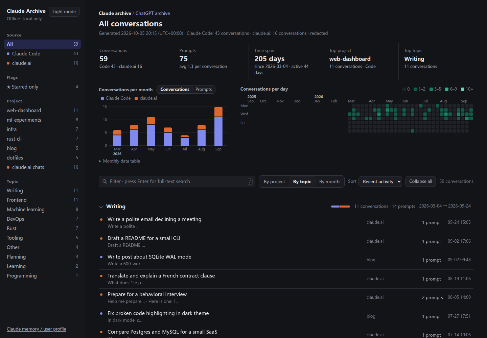
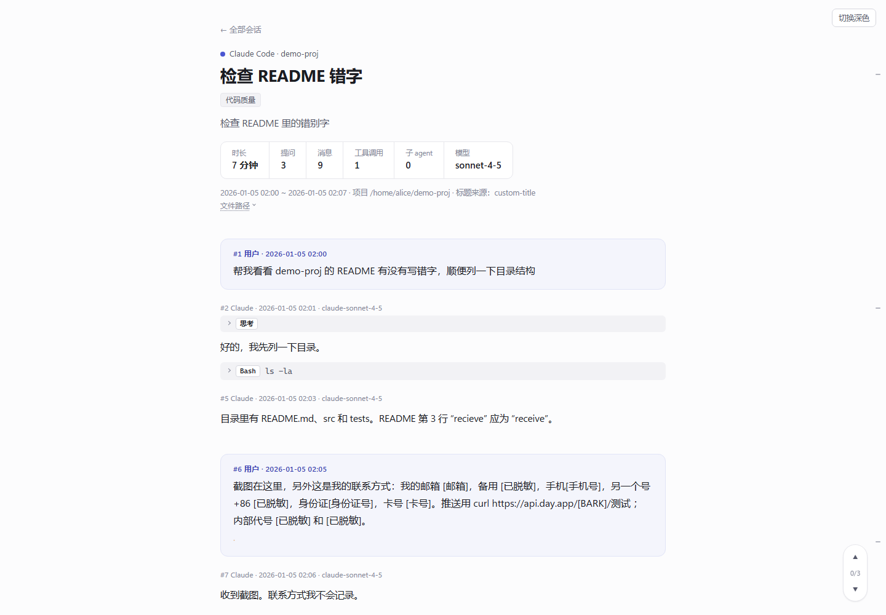
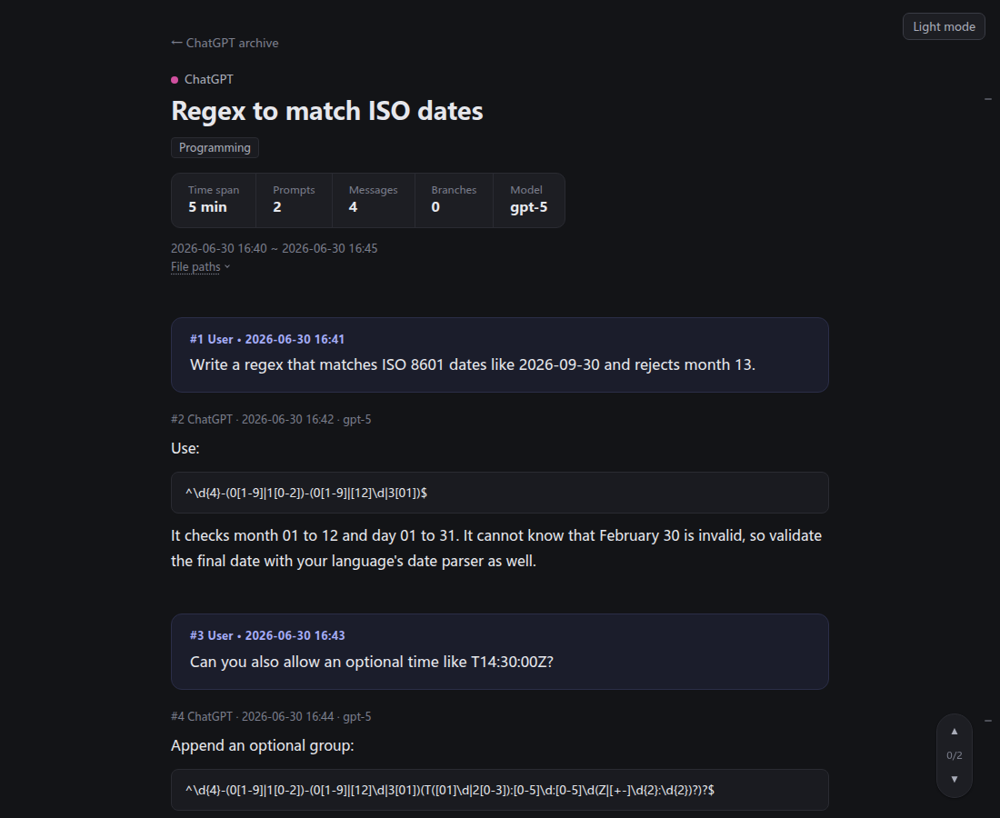
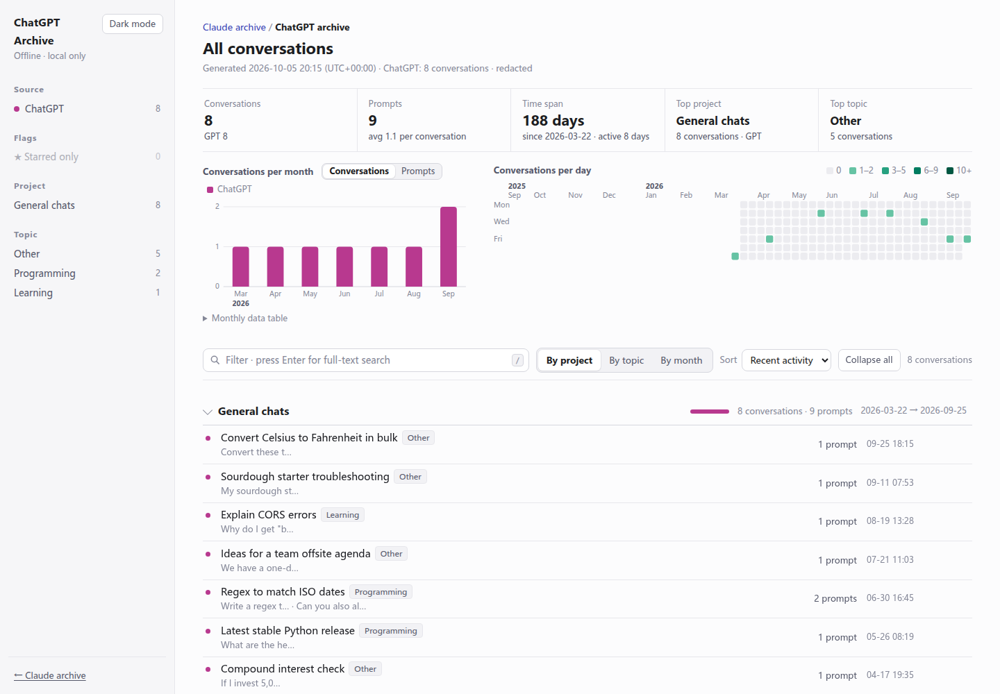

<p align="center">
  <picture>
    <source media="(prefers-color-scheme: dark)" srcset="assets/readme/hero-dark.gif">
    
  </picture>
</p>

<p align="center">
  <a href="#quick-start">Quick start</a> ·
  <a href="#features">Features</a> ·
  <a href="#faq">FAQ</a> ·
  <a href="README.zh-CN.md">中文说明</a>
</p>

<p align="center">
  
  
  
  
  <a href="LICENSE"></a>
</p>

**claude-chat-archive** merges your local **Claude Code sessions**, your **claude.ai data export** and (optionally) your **ChatGPT data export** into an **offline web archive** with filters, charts and full-text search, plus **chunked Markdown that Claude itself can read**. It can also put your old sessions back into the **Claude desktop app** and turn claude.ai chats into Claude Code sessions you can keep talking to. Everything runs on your own machine: no network, no server, no upload.

## See it in action

<p align="center">
  <picture>
    <source media="(prefers-color-scheme: dark)" srcset="assets/readme/demo-dark.gif">
    
  </picture>
</p>

<sub>Type to filter (stats, charts and list update as you type), press Enter for full-text search, open a hit, then <kbd>j</kbd> / <kbd>k</kbd> to jump between prompts. Recorded on made-up demo data.</sub>

## What else it does

Beyond browsing Claude Code sessions, it can:

- **Continue claude.ai chats in Claude Code**  
  claude.ai can export conversations but not import them. `--import-claude-ai` turns your export into Claude Code sessions you can resume in the desktop app.
- **Put old sessions back in the desktop app**  
  Sessions you ran in a terminal, or lost after switching accounts or reinstalling, reappear in the Claude desktop app's Code sidebar, grouped by folder (`--register-desktop`).
- **Merge three histories**  
  Claude Code, the claude.ai export and the ChatGPT export, in one offline archive with full-text search.
- **Write docs for Claude**  
  Chunked Markdown with monthly indexes, so your local Claude can look up past conversations.

<p align="center">
  <picture>
    <source media="(prefers-color-scheme: dark)" srcset="assets/readme/sidebar-dark.gif">
    
  </picture>
</p>

<sub>Mock-up with made-up titles. The desktop-app features rely on the app's internal file format (not a public API) and are tested on Windows + WSL only; see <a href="#optional-show-old-sessions-in-the-desktop-apps-code-view">details</a>.</sub>

## How it works



> [!WARNING]
> **Local use only.** The output directory contains your **raw conversations** with Claude (code, accounts, personal matters).
> **Never commit it to git, never put it in a synced folder, never upload or share it.** Redaction (on by default) only catches things with a fixed format — emails, phone numbers, keys — not names, stories, or screenshots. See [docs/PRIVACY.md](docs/PRIVACY.md) (Chinese).

## Screenshots

<table><tr>
<td width="50%"></td>
<td width="50%"></td>
</tr><tr>
<td align="center">Home: filters, monthly chart, daily heatmap</td>
<td align="center">Dark mode, grouped by topic</td>
</tr><tr>
<td></td>
<td></td>
</tr><tr>
<td align="center">Session page: collapsible thinking and tool calls</td>
<td align="center">ChatGPT history gets its own page</td>
</tr></table>

<sub>All screenshots and animations use made-up demo data (<code>assets/readme/source/make_demo_data.py</code>); regenerate them with the scripts in <code>assets/readme/source/</code>.</sub>

> **Language:** the interface (web pages, the Markdown docs for Claude, command-line output) is English by default. Set `"language": "zh"` in the config for a Chinese interface. Your own conversations are never translated.

## Features

- **Two sources, one archive**: Claude Code sessions under `~/.claude/projects` (including sub-agents and workflows) and the claude.ai data export. On WSL it also picks up sessions from the Windows side.
- **ChatGPT history (optional)**: the official ChatGPT data export gets its own page, `chatgpt/index.html` (cross-linked with the Claude archive), with the same filters and full-text search; code, execution output, reasoning, Canvas documents and images are kept. See "ChatGPT history" below.
- **Home page**: group by project / topic / month; filter by source, star, project, topic; monthly bar chart and daily heatmap; type to filter titles, press Enter for full-text search.
- **Full-text search** across every prompt and reply; results jump straight to the matching text.
- **Session pages**: the full message flow; thinking, tool calls, compaction summaries and claude.ai branches are collapsible; a prompt navigator on the right, `j` / `k` to jump between prompts.
- **Handles the messy parts of the data**: content duplicated by resumed sessions is shown once; context compaction boundaries are marked; sub-agents are linked back to the call that spawned them; claude.ai edit / regenerate branches are all kept; claude.ai artifacts are replayed to their final version. See [docs/HOW-IT-WORKS.md](docs/HOW-IT-WORKS.md) (Chinese).
- **Docs for Claude**: Markdown split into chunks that each fit in a single Claude Code `Read` call, with monthly indexes. Point your local Claude at the folder and it can look up past conversations.
- **Redaction on by default**: emails, phone numbers, Chinese ID and bank card numbers (checksum-verified), API keys, private keys and more are replaced when data is read, and all output is re-scanned at the end.
- **Bring old sessions into the desktop app (optional)**: sessions you ran in a terminal don't show up in the Claude desktop app's Code view. You can register them there and pick them up again, and claude.ai conversations can be converted into Claude Code sessions and added too. See "Show old sessions in the desktop app's Code view" below.
- **Light and dark themes**, following the system or toggled by hand.
- **Minimal dependencies**: Python 3.9+ standard library only. Optionally `markdown-it-py` for nicer Markdown rendering (the installer puts it in the repo's own `.venv`).

## Quick start

**macOS / Linux / WSL:**

```bash
git clone https://github.com/jackdhch/claude-chat-archive.git
cd claude-chat-archive
bash install.sh
```

**Windows (PowerShell):**

```powershell
git clone https://github.com/jackdhch/claude-chat-archive.git; cd claude-chat-archive; powershell -ExecutionPolicy Bypass -File .\install.ps1
```

The installer:

1. checks for Python 3.9+;
2. asks whether to install `markdown-it-py` into the repo's `.venv` (the only step that touches the network — a plain `pip install`; optional);
3. auto-detects data locations and writes a config file (an existing config is never overwritten);
4. runs a health check listing how many files each source has;
5. runs the first export;
6. asks whether to add a daily scheduled update.

Then open `index.html` in the output directory (default `~/claude-archive-output/index.html`; the installer prints the command).

Flags (Windows spelling in parentheses):

| Flag | Effect |
|---|---|
| `--yes` (`-Yes`) | no questions, accept all defaults. **The defaults are: install markdown-it-py (network) and add a daily scheduled job** |
| `--no-schedule` (`-NoSchedule`) | don't add a scheduled job |
| `--no-markdown` (`-NoMarkdown`) | don't install markdown-it-py; the whole install stays offline |
| `--time 07:30` (`-Time 07:30`) | time of the scheduled job |

Fully unattended, offline, no scheduling: `bash install.sh --yes --no-markdown --no-schedule`. Re-running the installer is safe. Installing markdown-it-py leaves a pip cache in `~/.cache/pip`, which uninstall does not remove.

**WSL users**: auto-detection also picks up the Windows side (`C:\Users\<you>\.claude\projects`, claude.ai archives in the Windows Downloads folder). Remove those `/mnt/c/...` paths from the config if you only want WSL sessions.

**Want your claude.ai chats too?** In claude.ai go to Settings → Privacy → Export data. The emailed download link expires 24 hours after delivery. Put the `data-…-batch-0000.zip` file(s) in your Downloads folder (no need to unzip) and run the export again. Details in [docs/CONFIG.md](docs/CONFIG.md).

## ChatGPT history

To archive your ChatGPT web conversations too:

1. In ChatGPT: avatar → **Settings → Data controls → Export data**, then confirm.
2. You get an email with a download link (it expires; request again if needed, and sign in with the same account to download).
3. Put the zip in your Downloads folder (no need to unzip or rename) and run the export again. The config field `chatgpt_zips` defaults to `~/Downloads/*.zip` (on WSL the Windows Downloads folder is added too). **Archives are recognised by content**: a zip counts as ChatGPT's only if it has `conversations.json` (large accounts are split into `conversations-000.json`, …) whose conversations carry a `mapping`. claude.ai archives and unrelated zips are skipped.

Output goes to `<out>/chatgpt/`:

- `chatgpt/index.html`: the ChatGPT home page ("ChatGPT 对话存档"), sharing the stylesheet and scripts one level up; its source colour is magenta. Grouping by "project" treats a custom GPT as a project and puts the rest under "普通对话" (plain chats). Both home pages link to each other at the top ("Claude 存档 / ChatGPT 存档").
- `chatgpt/s/gpt-<id>.html`: session pages. Code, execution output and reasoning are collapsible; Canvas documents are saved under `files/gpt-<id>/`; images go to `chatgpt/img/`; your custom instructions are shown once, collapsed, at the top; old branches from "edit and resend" / "regenerate" hang collapsed where they diverged.
- `docs/gpt/` and `docs/index/gpt-YYYY-MM.md`: chunked Markdown for Claude to read (see `docs/README.md`).
- Without a ChatGPT archive there is no `chatgpt/` folder, and the Claude home page shows no link to it.

Hidden content (system prompts, the memory tool, internal web-browsing data, empty messages — the ChatGPT web UI does not show them either) is left out of the pages but counted by reason in `report.txt`. `--doctor` shows how many ChatGPT archives and conversations were found.

<table><tr>
<td></td>
<td></td>
</tr><tr>
<td align="center">ChatGPT home (light)</td>
<td align="center">Session page (dark): code, output and reasoning collapse</td>
</tr></table>

## Manual usage

Without the installer (with no config file, data sources are auto-detected and defaults are used):

```bash
python3 claude_archive.py --init-config   # optional: write a config file and print detected sources
python3 claude_archive.py --doctor        # check only: files found per source, config validity; no export
python3 claude_archive.py                 # export (a few minutes for a few hundred sessions)
```

| Flag | Effect |
|---|---|
| `--config PATH` | use a specific config file |
| `--out DIR` | write to a different directory this time |
| `--redact` / `--no-redact` | force redaction on / off this time |
| `--allow-synced-output` | allow output inside a git work tree or synced folder (not recommended) |
| `--selftest` | run only the redaction and branch-tree self-tests |
| `--dump-prompts DIR` / `--dump-convs DIR` | export prompts without a navigator title / sessions without topics (for AI processing, see below) |
| `--register-desktop` / `--register-desktop --write` | list / register old sessions missing from the desktop app's Code view (see below) |
| `--import-claude-ai` / `--import-claude-ai --write` | list / convert claude.ai conversations into Claude Code sessions (see below) |
| `--merge-titles FILE…` / `--merge-topics FILE…` | merge AI-written titles `{"prompt-id": "title"}` / topics `{"session-id": {"t": ["topic"], "s": "one-line summary"}}` (optional `"_topics"` table) into the local cache |

Exit codes: `0` success; `1` final checks failed (previous output left untouched, reasons in the report); `2` config error.

Config file: `~/.config/claude-archive/config.json` (respects `$XDG_CONFIG_HOME`; Windows `%APPDATA%\claude-archive\config.json`). Main fields:

| Field | Default | Meaning |
|---|---|---|
| `out_dir` | `~/claude-archive-output` | output directory; must be local, not in a git work tree or synced folder |
| `claude_code_roots` | `["~/.claude/projects"]` | Claude Code session folders (WSL also adds the Windows side) |
| `extra_backup_roots` | `[]` | your own backups, used only for sessions already deleted from the source |
| `claude_ai_zips` | `["~/Downloads/data-*-batch-*.zip"]` | claude.ai export archives (globs) |
| `chatgpt_zips` | `["~/Downloads/*.zip"]` | globs of zips to check for a ChatGPT export (recognised by content, not by name) |
| `desktop_meta_globs` | auto-detected | Claude desktop app metadata (title, star, archived) |
| `redact` | `true` | redaction on/off |
| `redact_literals` / `redact_literal_files` | `[]` | exact strings (or files with one per line) to always redact |
| `doc_token_limit` | `15000` | estimated token budget per Markdown chunk |
| `timezone` | `"local"` | display time zone, or a UTC offset like `"+08:00"` |
| `language` | `"en"` | interface language: `"en"` or `"zh"` |

Full reference (Chinese): [docs/CONFIG.md](docs/CONFIG.md).

### Let your local Claude read your history

Add one line to your **machine-local, global** `~/.claude/CLAUDE.md` (not a project `CLAUDE.md` that gets committed):

```
Conversation archive: ~/claude-archive-output/docs/README.md — read it first, then Grep.
```

## Optional: AI-written prompt titles and topics

By default the navigator shows each prompt's first sentence, and "group by topic" is empty. Claude can fill these in:

- **As a Claude Code skill (recommended)**: `mkdir -p ~/.claude/skills && cp -r skills/claude-archive ~/.claude/skills/`, then ask Claude to "update my chat archive".
- **As a script**: `python3 scripts/enrich_with_claude.py` (requires the `claude` CLI).

Details in [skills/README.md](skills/README.md) (Chinese). Both use `--dump-prompts` / `--dump-convs` to export what's missing and `--merge-titles` / `--merge-topics` to merge results into the local cache.

> [!NOTE]
> This step **does use the network**: prompt excerpts and session titles are sent to Anthropic and count against your Claude usage. The export itself stays fully offline, and everything works without this step.

## Scheduled updates

The installer can add a daily job (default 19:00):

- **macOS / Linux / WSL**: one crontab line tagged `# claude-archive`; your other crontab lines are untouched. Log: `~/.local/share/claude-archive/cron.log`. On WSL, start cron first (`sudo service cron start`); jobs don't run while WSL is off. On macOS, grant `/usr/sbin/cron` Full Disk Access to read `~/Downloads`.
- **Windows**: a Task Scheduler task named `claude-archive`.

Re-run the installer with `--time HH:MM` to change the time; the old job is replaced.

## Optional: show old sessions in the desktop app's Code view

Claude Code sessions you ran in a terminal don't appear in the Claude desktop app's Code view, and after switching accounts or reinstalling the app your earlier sessions disappear from the sidebar. The transcripts are still in `~/.claude/projects`; the desktop app just has no entry for them.

See the animation in [What else it does](#what-else-it-does).

```bash
python3 claude_archive.py --register-desktop          # list unregistered sessions, write nothing
python3 claude_archive.py --register-desktop --write  # register them
```

Then **fully quit the desktop app** (including the tray icon) and reopen it. Old sessions show up in the sidebar under their original folders, and you can continue any of them.

- **Prerequisite**: open any session in the desktop app's Code view first, so the app creates the registry folder for your current account. The tool writes into the most recently used registry folder, located via `desktop_meta_globs`.
- **Adds, never edits**: one new `local_*.json` per session; existing entries are left alone. Already-registered sessions are skipped, so it's safe to re-run. To undo, delete the files it added.
- **What gets registered**: main sessions with at least one prompt under `claude_code_roots`. Backups in `extra_backup_roots`, empty sessions and sub-agents are skipped. On WSL, copies of WSL sessions stored on the Windows drive are also skipped, because the app can't resume them.
- **Same-titled sessions**: continuing an old session in Claude Code often starts a new session that copies the earlier content, so the sidebar fills up with sessions that share a title. A session whose content is at least 90% contained in a session that ended later is registered as archived: hidden from the sidebar by default, still available under archived sessions.
- **Caveat**: this relies on the desktop app's internal file format, not a public API, and may break when the app updates. Tested only with the Microsoft Store build of the desktop app on Windows + WSL; the macOS and Linux registry paths follow the same pattern but haven't been tested.

### Bring claude.ai conversations in too

claude.ai can export conversations but can't import them. Instead, this converts the conversations in your export into Claude Code sessions so they show up in the Code view, where you can read them and continue them (in the Code tab, not the Chat tab).

```bash
python3 claude_archive.py --import-claude-ai          # list conversations to convert, write nothing
python3 claude_archive.py --import-claude-ai --write  # convert
python3 claude_archive.py --register-desktop --write  # register them, then fully quit and reopen the desktop app
```

- **Where they go**: converted sessions belong to the folder `~/claude-ai-chats` (created if missing), so they form their own group in the sidebar, with titles prefixed `[claude.ai]`.
- **What's included**: only each conversation's main line, the version you last saw; other branches from edits and regenerations are left out. Prompts, replies and attachment text are kept verbatim.
- **No redaction**: conversion always uses the original text, whatever `redact` says. This is written back into your own Claude data so you can continue the conversation; placeholders would just corrupt it.
- **What changes**: past tool calls (web search, file generation, …) become one-line notes, tool results are cut to 500 characters, and thinking is dropped. Kept as-is, they would cause format errors when you continue.
- **Never overwrites**: each conversation maps to a fixed session id, and already-converted ones are skipped, so anything you've added by continuing a session is safe and re-running is fine. Empty conversations are skipped.
- **Very long conversations** may exceed the context window when you continue; run `/compact` in the session first.

## FAQ

**It refuses to run: "inside a git work tree" / "looks like a synced folder".** Intentional. Pick a plain local `out_dir`, or pass `--allow-synced-output` if you really mean it.

**My home directory is itself a git repo (dotfiles), so the default output is refused too.** The check walks up looking for a real `.git` (`.git/HEAD` exists, or `.git` is a file; an empty leftover `.git` folder doesn't count). Put `out_dir` outside that repo, or pass `--allow-synced-output` once you're sure it won't be committed.

**Old sessions are missing.** Claude Code deletes sessions older than 30 days by default; deleted ones can't be recovered. Add `"cleanupPeriodDays": 3650` to `~/.claude/settings.json` to keep them.

**ChatGPT chats don't show up.** Run `--doctor` and look for "找到 ChatGPT 导出包 N 个" (ChatGPT archives found). The zip must match `chatgpt_zips` (by default any `*.zip` in Downloads) and contain `conversations.json`. The ChatGPT page is `chatgpt/index.html`, linked from the top of the main home page.

**claude.ai chats don't show up.** Run `--doctor`. The archives must match `claude_ai_zips`; if the export was split into several batches, download all of them — a missing batch number is an error.

**Checks failed (exit code 1).** Your previous output is untouched; the new build is in `…output.new`. See the "检查失败" (checks failed) section at the end of `report.txt`. If redaction left something behind, please open an issue with the rule name only — **never paste the original text**.

**Markdown shows as plain text.** `markdown-it-py` isn't installed; re-run the installer and accept, or `pip install markdown-it-py`.

**Will it modify my Claude data?** Exporting doesn't. All sources are read-only, and credential files (`~/.claude/sessions/`, `*.key`, …) are never opened. The only exceptions are two commands you run yourself: `--register-desktop --write` adds registry entries to the desktop app's folder without changing existing ones; `--import-claude-ai --write` adds session files under `~/.claude/projects`. Neither changes existing transcripts.

## Uninstall

```bash
bash uninstall.sh                  # remove the scheduled job; asks about config and cache
bash uninstall.sh --yes            # no questions: remove the job, keep config and cache
bash uninstall.sh --purge-config   # delete config and cache without asking (cache holds AI-written titles/topics)
bash uninstall.sh --purge-output   # also delete the exported archive
```

Windows: `powershell -ExecutionPolicy Bypass -File .\uninstall.ps1` (`-PurgeConfig`, `-PurgeOutput`).

The repo folder and `.venv` are left alone — delete the folder if you're done. Think before deleting the output: it may be the only copy of sessions Claude Code has already cleaned up.

## Tests

```bash
bash tests/run_tests.sh      # runs on the fake data in tests/fixtures in a temporary HOME, ~5 s, never touches real data
```

`KEEP=1` keeps the temp dir; `PYTHON=.venv/bin/python` runs with markdown-it-py.

## License

[MIT](LICENSE). Not affiliated with Anthropic; not an official tool. Claude Code's session files are an undocumented internal format and may change.
