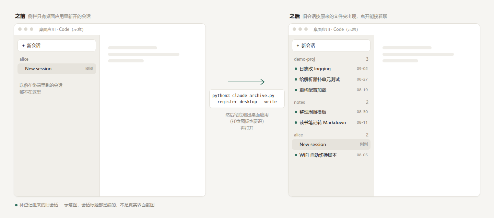

# Claude 对话存档（claude-chat-archive）

[English](README.en.md)

把你电脑上的 **Claude Code 会话**和 **claude.ai 官方导出包**合并成一个**离线网页**（可筛选、全文搜索），外加一份**给 Claude 自己读的分块 Markdown 文档**——全程只在本机，不联网、不上传。

> [!WARNING]
> **仅限本机使用。** 生成的输出目录里是你和 Claude 的**原始对话**（代码、账号、私事都可能在里面）。
> **千万别把输出目录提交到 git、别放进同步盘、别上传、别发给别人。** 默认脱敏只遮得住邮箱、手机号、密钥这类有格式的东西，遮不住人名、案情、截图。详见 [docs/PRIVACY.md](docs/PRIVACY.md)。


<table><tr>
<td></td>
<td></td>
</tr><tr>
<td align="center">深色模式，按主题分组</td>
<td align="center">会话页：思考、工具调用可折叠，敏感信息已换成占位符</td>
</tr></table>

<sub>截图全部由 `tests/fixtures` 里的假数据生成。</sub>

## 功能

- **两个来源合在一起**：本机 `~/.claude/projects` 下的 Claude Code 会话（含子 agent、workflow），和 claude.ai 设置里导出的数据包。Windows + WSL 两边的会话也能一起收。
- **ChatGPT 历史（可选）**：ChatGPT 官方导出包也能收，单独生成一个页面 `chatgpt/index.html`（和 Claude 存档互相有链接），同样可筛选、全文搜索，代码、执行结果、思考、Canvas 文档、图片都保留。见下面“ChatGPT 历史”一节。
- **首页**：按项目 / 主题 / 月份分组，按来源、星标、项目、主题筛选；每月会话数柱状图、每天活跃热力图；输入即过滤标题，回车搜全文。
- **全文搜索**：搜所有提问和回答，点结果直接跳到原文位置。
- **会话页**：完整消息流；思考过程、工具调用、上下文压缩摘要、claude.ai 的分支都可以折叠展开；右侧提问导航条，`j` / `k` 键跳到下一个 / 上一个提问。
- **处理了数据里的坑**：续接会话复制的重复内容只显示一次；上下文压缩画分隔线；子 agent 挂回调用处；claude.ai “改写重发 / 重新生成”产生的分支都保留；claude.ai 里生成的文件（artifact）按修改记录还原出最终版。原理见 [docs/HOW-IT-WORKS.md](docs/HOW-IT-WORKS.md)。
- **给 Claude 读的文档**：按大小切块，每块都在 Claude Code 的 Read 工具一次能读完的范围内，带月索引。告诉本机的 Claude 这个目录在哪，它就能翻你以前的对话。
- **默认脱敏**：邮箱、手机号、身份证号、银行卡号、API 密钥、私钥等在读入时就换成占位符，最后还会整体复扫一遍。
- **找回桌面应用里的旧会话（可选）**：在终端里跑的会话，Claude 桌面应用的 Code 界面默认不显示。可以把它们补登记进去，点开就能接着聊。claude.ai 网页版的对话也能转成 Claude Code 会话放进去。见下面“让旧会话出现在桌面应用的 Code 界面”一节。
- **浅色 / 深色**两套配色，跟随系统，也可手动切换。
- **依赖少**：只要 Python 3.9+，全部用标准库。可选装 markdown-it-py 让 Markdown 排版更好看（安装脚本会装在仓库自己的 `.venv` 里，不动系统环境）。

## 一键安装

**macOS / Linux / WSL：**

```bash
git clone https://github.com/jackdhch/claude-chat-archive.git
cd claude-chat-archive
bash install.sh
```

**Windows（PowerShell）：**

```powershell
git clone https://github.com/jackdhch/claude-chat-archive.git; cd claude-chat-archive; powershell -ExecutionPolicy Bypass -File .\install.ps1
```

安装脚本会依次：

1. 检查 Python 3.9+；
2. 问你要不要在仓库的 `.venv` 里装 markdown-it-py（这是唯一联网的一步，只是 `pip install`；不装也能用）；
3. 自动探测数据位置，写一份配置（已有配置不会被覆盖）；
4. 体检：列出每个数据源找到多少文件；
5. 第一次导出；
6. 问你要不要加每天自动更新的定时任务。

完成后打开输出目录里的 `index.html` 就能看（默认在 `~/claude-archive-output/index.html`，安装脚本最后会打印打开命令）。

常用参数：

| 参数（Windows 写法） | 作用 |
|---|---|
| `--yes`（`-Yes`） | 不提问，全部按默认。**注意默认是“装 markdown-it-py（联网）”和“加每日定时任务”** |
| `--no-schedule`（`-NoSchedule`） | 不加定时任务 |
| `--no-markdown`（`-NoMarkdown`） | 不装 markdown-it-py，整个安装完全不联网 |
| `--time 07:30`（`-Time 07:30`） | 定时任务时间 |

想全自动又不联网、不加定时任务：`bash install.sh --yes --no-markdown --no-schedule`。重复运行安装脚本是安全的。装 markdown-it-py 时 pip 会在 `~/.cache/pip` 留缓存，卸载脚本不删它。

**WSL 用户注意**：自动探测会把 Windows 那边的 `C:\Users\<你>\.claude\projects`、Windows 下载文件夹里的 claude.ai 导出包也一起收进来。只想要 WSL 里的会话，就在配置里把这些 `/mnt/c/...` 路径删掉。

**想收录 claude.ai 的对话？** 先在 claude.ai 的 设置 → 隐私（Privacy）→ 导出数据（Export data）申请导出，邮件里的链接 24 小时内有效，把下载的 `data-…-batch-0000.zip` 放在下载文件夹（不用解压），再运行一次导出即可。详见 [docs/CONFIG.md](docs/CONFIG.md#claudeai-的数据怎么导出)。

## ChatGPT 历史

想把 ChatGPT 网页上的对话也存下来：

1. 打开 ChatGPT 网页 → 点右上角头像 → **设置（Settings）→ 数据控制（Data controls）→ 导出数据（Export data）**，确认导出。
2. 过一会儿收到一封邮件，点里面的链接下载 zip（链接有有效期，过期就重新申请；下载要登录同一个账号）。
3. 把 zip 放进下载文件夹（不用解压、不用改名）。再运行一次导出就行——配置项 `chatgpt_zips` 默认就是 `~/Downloads/*.zip`（WSL 下还会加上 Windows 的下载文件夹），**工具按内容认包**：zip 里有 `conversations.json`（大账号会拆成 `conversations-000.json`……）且对话带 `mapping` 才算 ChatGPT 的包，claude.ai 的包和别的 zip 会自动跳过。

结果单独放在 `<输出目录>/chatgpt/`：

- `chatgpt/index.html`：ChatGPT 首页（标题“ChatGPT 对话存档”）。样式和脚本用的是上一级的同一套，来源色是洋红。按“项目”分组时，自定义 GPT 算一个项目，普通对话归“普通对话”。首页顶部有“Claude 存档 / ChatGPT 存档”互相跳转的链接。
- `chatgpt/s/gpt-<id>.html`：会话页。代码、执行结果、思考做成折叠条；Canvas 文档另存在 `files/gpt-<id>/`；图片放 `chatgpt/img/`；你在设置里写的自定义指令在页首折叠显示一次；“编辑后重发”和“重新生成”留下的旧分支折叠挂在原位。
- `docs/gpt/`、`docs/index/gpt-YYYY-MM.md`：给 Claude 读的分块 Markdown，`docs/README.md` 里有说明。
- 没有 ChatGPT 包时不会生成 `chatgpt/`，Claude 首页也不显示那个链接。

隐藏的内容（系统提示词、记忆工具、联网搜索的内部数据、空消息等，ChatGPT 网页本来也不显示）不会出现在页面里，但会在 `report.txt` 里按原因计数。`--doctor` 会显示找到几个 ChatGPT 包、多少段对话。

<table><tr>
<td></td>
<td></td>
</tr><tr>
<td align="center">ChatGPT 首页（浅色）</td>
<td align="center">会话页（深色）：代码、执行结果、思考可折叠</td>
</tr></table>

## 手动用法

不想用安装脚本也行，直接运行（没有配置文件时自动探测数据源、使用默认值）：

```bash
python3 claude_archive.py --init-config   # 可选：生成配置文件并打印探测到的数据源
python3 claude_archive.py --doctor        # 只检查：每个数据源找到多少文件、配置对不对，不导出
python3 claude_archive.py                 # 导出（几百个会话大约几分钟）
```

其他参数：

| 参数 | 作用 |
|---|---|
| `--config 路径` | 用指定的配置文件 |
| `--out 目录` | 这次输出到别的目录 |
| `--redact` / `--no-redact` | 这次强制开 / 关脱敏 |
| `--allow-synced-output` | 允许输出到 git 工作区或同步盘里（不建议） |
| `--selftest` | 只跑脱敏规则和分支树自检 |
| `--dump-prompts 目录` / `--dump-convs 目录` | 导出还没有小标题的提问 / 还没有主题的会话（给 AI 处理，见下文“可选”一节） |
| `--register-desktop` / `--register-desktop --write` | 列出 / 补登记桌面应用 Code 界面里看不到的旧会话（见下文） |
| `--import-claude-ai` / `--import-claude-ai --write` | 列出 / 把 claude.ai 对话转成 Claude Code 会话（见下文） |
| `--merge-titles 文件…` / `--merge-topics 文件…` | 把 AI 写好的小标题 / 主题合并进本机缓存，格式见 [docs/CONFIG.md](docs/CONFIG.md#ai-小标题和主题的文件格式) |

退出码：`0` 成功；`1` 最后的检查没通过（旧输出不动，原因写在报告里）；`2` 配置有错。

所有配置项、各系统的默认数据位置见 **[docs/CONFIG.md](docs/CONFIG.md)**。

### 输出里有什么

```
~/claude-archive-output/
  index.html          首页（浏览器直接打开）
  profile.html        Claude 的记忆文件 / 用户画像
  data.js             首页用的会话列表（含标题、小标题）
  search.js           全文搜索索引（含全部对话正文）
  app.js style.css theme.js nav.js   网页脚本和样式
  s/                  每个会话一页（子 agent、workflow 在 s/cc-<会话>/ 下）
  files/              claude.ai 里生成的文件（还原出的最终版）；files/gpt-<对话>/ 是 ChatGPT 的 Canvas 文档
  img/                你粘贴过的截图（只进网页，不进文档）
  docs/README.md      给 Claude 读的文档入口
  docs/cc/ docs/ai/ docs/gpt/   Claude Code / claude.ai / ChatGPT 对话正文（分块 Markdown）
  docs/index/         按月索引（cc-、ai-、gpt- 三种）
  chatgpt/            ChatGPT 存档（有 ChatGPT 导出包时才有）：index.html、data.js、search.js、s/、img/
  docs/profile.md     记忆文件汇总
  stats.json          统计数字（下次导出会拿来比，数量变少就报警）
  report.txt          统计与检查结果（只有数字，没有对话内容）
```

导出时终端打印的一堆统计（如“CC丢弃:isMeta”“ai重放成功”“独立重数·人工提问”）是内部计数，用来排查问题，平时只看最后一行是不是“检查全部通过”就行。“独立重数”指不走主流程、从原始文件重新数一遍，用来和网页里的数量对账。

每次都是先生成到 `…output.new`，检查全部通过才替换，上一版保留为 `…output.prev`。

### 让本机的 Claude 读你的历史对话

在你**本机的全局** `~/.claude/CLAUDE.md` 里加一行（别写进会提交到 git 的项目 `CLAUDE.md`）：

```
历史对话存档：~/claude-archive-output/docs/README.md，先读它再 Grep。
```

之后可以直接问 Claude：“上个月我们讨论过的那个数据库迁移方案是怎么定的？”

## 可选：让 AI 写提问小标题和会话主题

默认情况下，会话页右侧导航显示的是每条提问的第一句话截短，首页“按主题”分组是空的。可以让 Claude 批量补上：

- **在 Claude Code 里用技能（推荐）**：`mkdir -p ~/.claude/skills && cp -r skills/claude-archive ~/.claude/skills/`，然后对 Claude 说“更新我的对话存档”。
- **用命令行脚本**：`python3 scripts/enrich_with_claude.py`（需要装好 `claude` 命令行）。

安装细节和两条路的区别见 [skills/README.md](skills/README.md)。两条路最后都是用 `--dump-prompts` / `--dump-convs` 导出待处理的内容，AI 写好后用 `--merge-titles` / `--merge-topics` 合并进本机缓存，下次导出时生效。

> [!NOTE]
> 这一步**会联网**：提问的前几百字、会话标题等会发给 Anthropic 处理，并消耗你 Claude 账号的额度。导出本身仍然完全离线；不做这一步也不影响任何功能。

## 定时更新

安装脚本可以替你加一个每天运行一次的定时任务（默认 19:00）：

- **macOS / Linux / WSL**：写一行 crontab，带 `# claude-archive` 标记，你原有的 crontab 行不动。日志在 `~/.local/share/claude-archive/cron.log`。
  - WSL：cron 默认不会自己启动，要先 `sudo service cron start`；WSL 没开着的时候任务也不会跑。
  - macOS：cron 读 `~/Downloads` 等目录需要在 系统设置 → 隐私与安全性 → 完全磁盘访问权限 里加入 `/usr/sbin/cron`。
- **Windows**：在“任务计划程序”里登记一个名为 `claude-archive` 的任务。

想改时间就重跑安装脚本并加 `--time HH:MM`（Windows 用 `-Time HH:MM`）；它会替换旧任务，不会加出第二条。

## 可选：让旧会话出现在桌面应用的 Code 界面

在终端里跑的 Claude Code 会话，Claude 桌面应用的 Code 界面默认不显示。换了账号或重装了桌面应用，以前的会话也会从侧栏消失。其实对话记录都还在 `~/.claude/projects` 里，只是桌面应用那边没登记。



```bash
python3 claude_archive.py --register-desktop          # 只列出还没登记的会话，不写
python3 claude_archive.py --register-desktop --write  # 补登记
```

写完后**彻底退出桌面应用**（托盘图标也要退出），再打开。旧会话会按原来的文件夹出现在侧栏里，点开就能接着聊。

- **先决条件**：先在桌面应用的 Code 界面里随便开一个会话，这样当前账号的登记文件夹才会建好。工具会写进最近用过的那个登记文件夹，去哪里找由配置项 `desktop_meta_globs` 决定。
- **只加不改**：每个会话新写一个 `local_*.json`，已有的登记文件不动。已经登记过的会话会跳过，所以可以反复跑。想撤销，删掉这次新加的文件就行。
- **哪些会登记**：`claude_code_roots` 里有过提问的主会话。`extra_backup_roots` 里的备份、空会话、子 agent 都不登记。WSL 用户放在 Windows 盘里的 WSL 会话副本也跳过，因为桌面应用接不上。
- **同名会话**：在 Claude Code 里接着旧会话继续聊，常会新开一个会话，把前面的内容复制过去，侧栏里就会出现一串同名会话。如果某个会话九成以上的内容都被一个更晚结束的会话包含，就登记为「已归档」：侧栏默认不显示，需要时可以从归档里找回。
- **注意**：这里用的是桌面应用自己的内部文件格式，不是官方接口，桌面应用升级后可能失效。目前只在 Windows 商店版桌面应用 + WSL 上实测过；macOS、Linux 的登记路径是照同样的规律推出来的，还没实测。

### claude.ai 的对话也放进来

claude.ai 只能导出对话，不能导入对话。这里的办法是把导出包里的对话转成 Claude Code 会话，放进 Code 界面。这样能在 Code 界面里看，也能接着聊（出现在 Code 标签里，不在 Chat 标签里）。

```bash
python3 claude_archive.py --import-claude-ai          # 只列出要转换的对话，不写
python3 claude_archive.py --import-claude-ai --write  # 转换
python3 claude_archive.py --register-desktop --write  # 登记进桌面应用，再彻底退出桌面应用重开
```

- **放在哪**：转出来的会话都属于 `~/claude-ai-chats` 这个文件夹（没有会自动建），所以在侧栏里单独成一组，标题前面带 `[claude.ai]`。
- **带哪些内容**：每段对话只带主线，也就是你最后看到的那一版；“改写重发 / 重新生成”留下的其他分支不带。提问、回答、附件里的文字都是原文。
- **不脱敏**：不管配置里 `redact` 怎么设，转换都用原文。这是写回你自己的 Claude 数据给它接着聊用的，脱敏成占位符只会把内容弄坏。
- **有改动的地方**：当时的工具调用（网页搜索、生成文件等）改成一行文字说明，工具结果只留前 500 字，思考过程不带。原样放进去的话，接着聊时会报格式错误。
- **转过的不覆盖**：每个对话算出的会话 id 是固定的，已经转过的直接跳过，你在里面接着聊的内容不会被冲掉，可以放心反复跑。空对话不转。
- **很长的对话**：接着聊时可能超出上下文长度，先在会话里用 `/compact` 压缩一下再聊。

## 常见问题

**Q：运行时报“位于 git 工作区里”或“像是同步盘”，拒绝运行？**
这是故意的。输出目录在 git 仓库里，一个 `git add .` 就可能把对话推上 GitHub；在 OneDrive / Dropbox / iCloud / 坚果云等目录里，文件会被自动传到云端。请把 `out_dir` 换成普通的本地目录（默认 `~/claude-archive-output`）。确实想这么做时加 `--allow-synced-output`。

**Q：我的主目录本身就是一个 git 仓库（用 git 管 dotfiles），默认输出目录也被拒绝了？**
检查会一路往上找 `.git`（只认真正的仓库：`.git/HEAD` 存在或 `.git` 是文件；只剩空壳的 `.git` 目录不算），所以 `~` 是 git 仓库时，`~/claude-archive-output` 也算在工作区里。把 `out_dir` 放到仓库外面（例如 `/data/claude-archive-output`），或者确认你的 dotfiles 仓库不会 `git add` 这个目录后再加 `--allow-synced-output`。

**Q：找不到某些旧会话？**
Claude Code 默认会删除 30 天前的会话记录，已删的找不回来。以后想长期保存，在 `~/.claude/settings.json` 里加 `"cleanupPeriodDays": 3650`。如果你自己另外备份过会话目录，可以加进配置的 `extra_backup_roots`。

**Q：claude.ai 的对话没出现？**
先跑 `--doctor` 看导出包有没有被找到。导出包要放在 `claude_ai_zips` 能匹配的位置（默认是下载文件夹），文件名形如 `data-…-batch-0000.zip`；拆成多个包时要全部下载，缺号会报错。

**Q：ChatGPT 的对话没出现？**
跑 `--doctor`，看“找到 ChatGPT 导出包 N 个”。导出包要放在 `chatgpt_zips` 能匹配的位置（默认是下载文件夹里任何 `*.zip`），而且里面要有 `conversations.json`。ChatGPT 页面在 `chatgpt/index.html`，不在根目录的首页里（首页顶部有链接）。

**Q：检查不通过（退出码 1）怎么办？**
旧输出没被动过，新产物留在 `…output.new` 里。看终端输出或 `…output.new/report.txt` 最后的“检查失败”一节。常见原因是脱敏复扫发现残留（说明某种写法没被规则覆盖，欢迎提 issue，**别贴原文**，只贴规则名）。

**Q：网页里的 Markdown 没有排版，显示成纯文本？**
没装 markdown-it-py。重跑安装脚本并同意安装，或者自己 `pip install markdown-it-py`。

**Q：浏览器打开是空白 / 搜索没反应？**
确认是直接双击 `index.html` 或用 `file://` 打开的，并且浏览器没禁用本地文件的 JavaScript。WSL 用户可以用 `explorer.exe "$(wslpath -w ~/claude-archive-output/index.html)"` 在 Windows 浏览器里打开。

**Q：想看不脱敏的原文？**
在配置里设 `"redact": false`，或者单次运行加 `--no-redact`。先读一下 [docs/PRIVACY.md](docs/PRIVACY.md)。

**Q：能导出给别人看吗？**
不建议，这个工具的设计就是只给你自己看。即使开着脱敏，人名、事情经过、截图都还在。

**Q：会不会动我的 Claude 数据？**
导出不会改。所有数据源都是只读的，凭据类文件（`~/.claude/sessions/`、`*.key` 等）碰都不碰。例外只有你主动运行的两条命令：`--register-desktop --write` 会在桌面应用的登记文件夹里新增登记文件，不改已有的；`--import-claude-ai --write` 会在 `~/.claude/projects` 里新增会话文件。两条都不改动已有的对话记录。

## 卸载

```bash
bash uninstall.sh                  # 删掉定时任务，问你要不要删配置和缓存
bash uninstall.sh --yes            # 不提问：删定时任务，保留配置和缓存
bash uninstall.sh --purge-config   # 不问，直接删配置和缓存（缓存里有 AI 写的小标题和主题）
bash uninstall.sh --purge-output   # 连导出的网页和文档一起删
```

Windows：`powershell -ExecutionPolicy Bypass -File .\uninstall.ps1`（可加 `-PurgeConfig`、`-PurgeOutput`）。

卸载脚本不会动仓库目录和 `.venv`，不要了直接删掉整个仓库目录即可。输出目录默认保留，删之前想清楚：那可能是你对话的唯一备份（Claude Code 会自动清理旧会话）。

## 跑测试

```bash
bash tests/run_tests.sh      # 用 tests/fixtures 的假数据在临时 HOME 里跑，约 5 秒，不碰真实数据
```

`KEEP=1` 保留临时目录便于排查，`PYTHON=.venv/bin/python` 用装了 markdown-it-py 的解释器跑。

## 更多文档

- [docs/CONFIG.md](docs/CONFIG.md)：配置项、各系统默认数据位置、claude.ai 数据导出步骤
- [docs/PRIVACY.md](docs/PRIVACY.md)：仅限本机的设计、脱敏规则和局限
- [docs/HOW-IT-WORKS.md](docs/HOW-IT-WORKS.md)：数据格式和处理方式

## 许可证

[MIT](LICENSE)。本项目与 Anthropic 无关，不是官方工具。Claude Code 的会话文件是未公开的内部格式，升级后可能需要调整。
